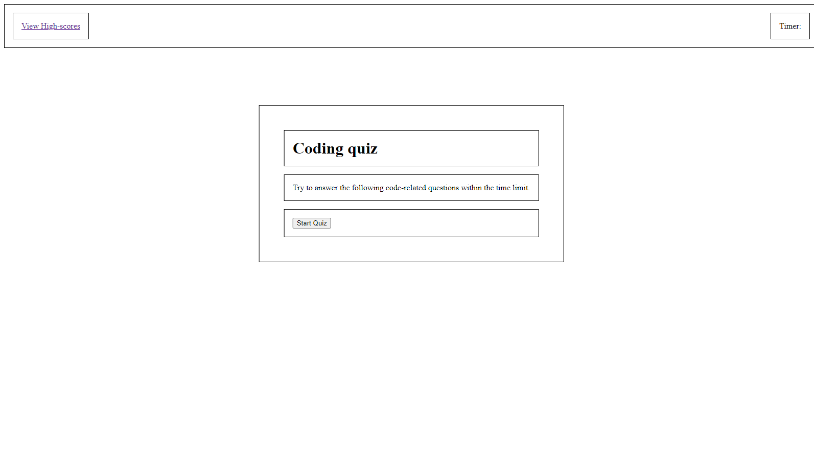
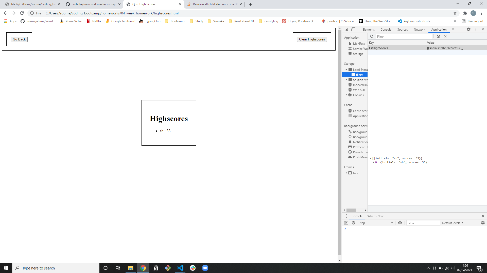

# Coding Quiz

## Table of Contents

- [Coding Quiz](#coding-quiz)
  - [Table of Contents](#table-of-contents)
  - [Github Pages URL](#github-pages-url)
  - [Description](#description)
    - [What Was Done](#what-was-done)
  - [Getting Started](#getting-started)
  - [Screenshots](#screenshots)
    - [Quiz Start Page](#quiz-start-page)
    - [High-scores Page with Local Storage](#high-scores-page-with-local-storage)

## Github Pages URL

https://soumeyah.github.io/coding_quiz/

## Description

We were tasked with creating a quiz which allows users to test their coding knowledge.

### What Was Done

- Dynamically created quiz.
  - Start page removed on start button click
  - Questions rendered one after the other on correct answer
  - Quiz end can submit score and go to highscores page.
- Highscores stored in local storage and rendered.
- Can be removed on click of clear higscores

In the future theres is a lot that needs improving sorry.

## Getting Started

- Clone GitHub project (repository coding_quiz) to your local machine.
- Navigate into project and open in VSCode.
- Open the index.html file in broswer preferably.

git clone git@github.com:SoumeyaH/coding_quiz.git

cd coding_quiz

code .

## Screenshots

### Quiz Start Page

### High-scores Page with Local Storage

